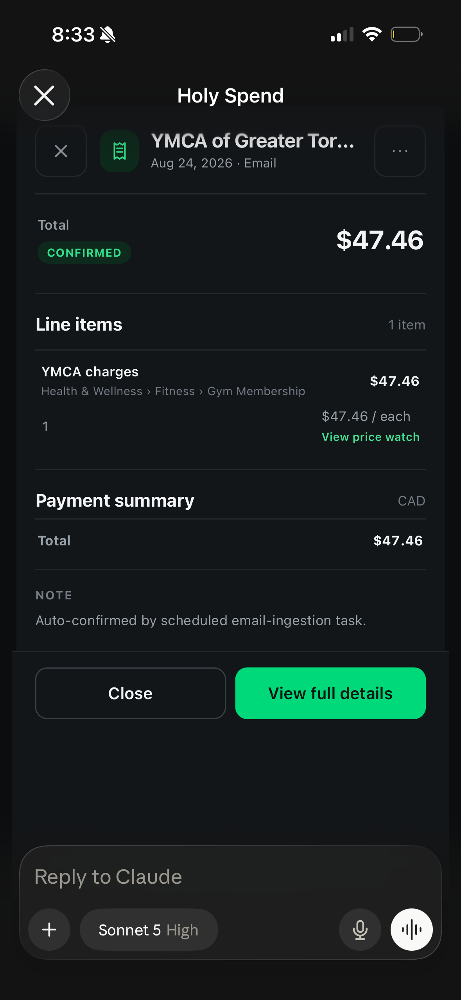
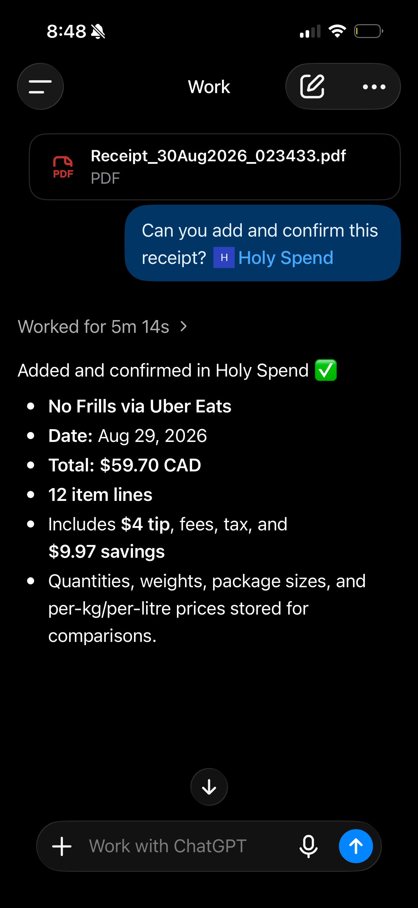
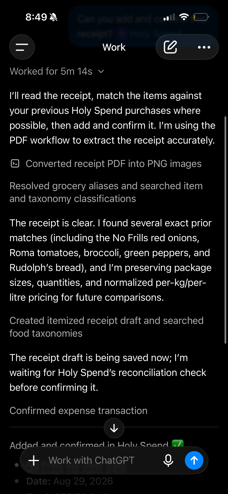
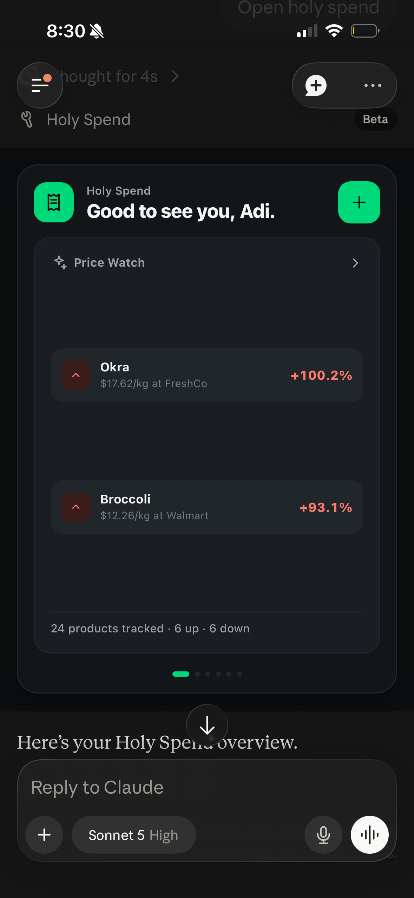
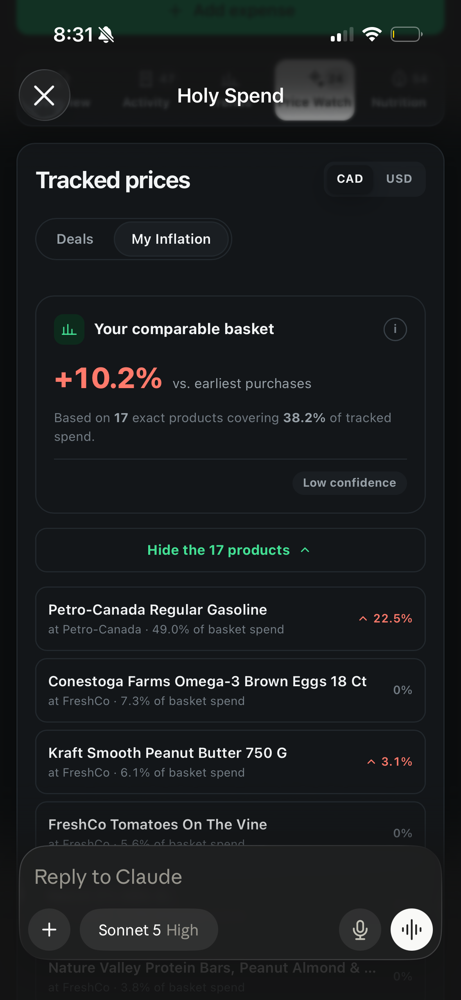
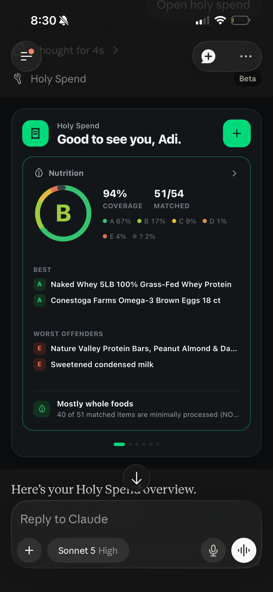
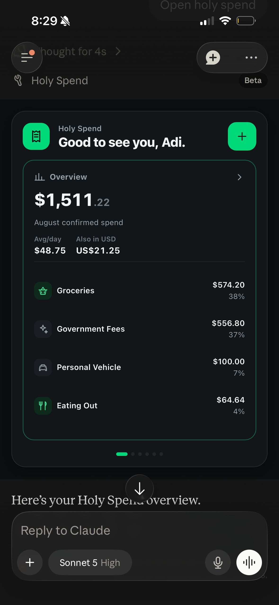
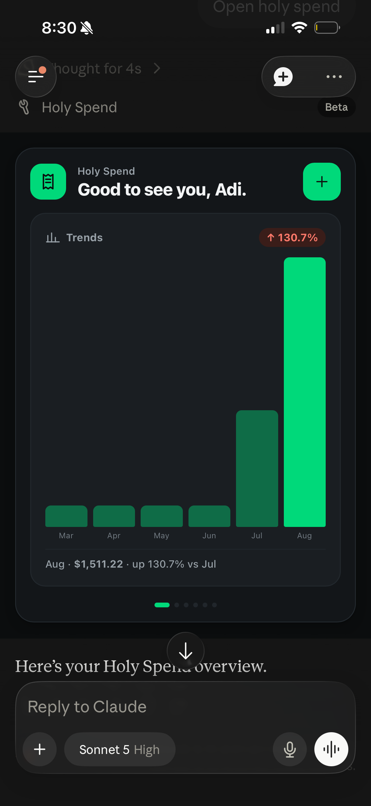
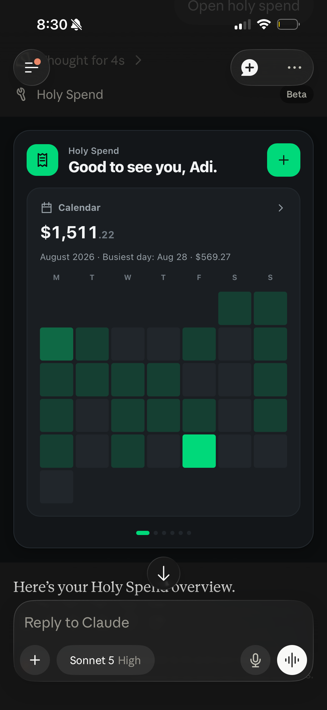
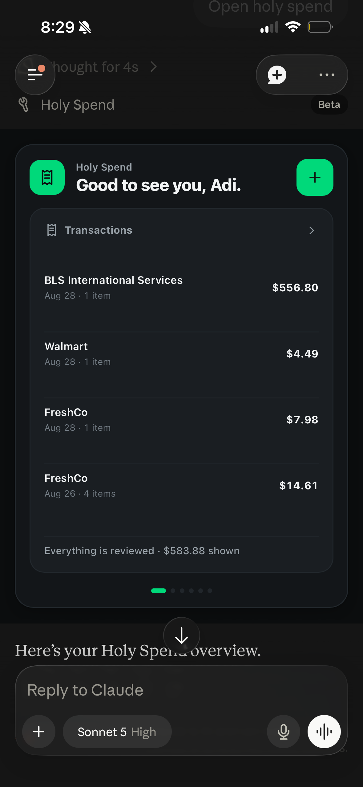

# Use cases

Real screens, from real chats. Nothing staged.

## Forwarding a bill

Amazon, Uber Eats, Instacart, your gym, your internet bill, whatever. Forward
the email, it reads it, checks it against what you've bought before, and it's
tracked. No itemizing, no app.

## Snapping a grocery receipt

Attach a photo or PDF and ask it to add and confirm. It checks your purchase
history before finalizing, then itemizes every line, priced per unit.

<table>
  <tr>
    <td align="center" width="50%">
      
    </td>
    <td align="center" width="50%">
      
    </td>
  </tr>
</table>

## Catching a price change

Per-unit price on everything you buy more than once, flagged the moment it
moves, sale sticker or not.

## Tracking your own inflation

Not the national number. Your own basket, built only from things you buy
more than once, priced honestly against what they cost you before.

## Grading your grocery basket

A to E, weighted by what you actually spend, so a cart of frozen pizza
doesn't score the same as a cart of vegetables just because they cost
the same.

## The monthly check-in

Spend by category, six months as a bar chart, a calendar heatmap of the
month, and everything waiting on you to confirm, all without leaving chat.

<table>
  <tr>
    <td align="center" width="33%">
      
    </td>
    <td align="center" width="33%">
      
    </td>
    <td align="center" width="33%">
      
    </td>
  </tr>
</table>

---

Works the same from Claude, ChatGPT, Cursor, or anything else that speaks
MCP - same server, same data, no separate setup per client.
